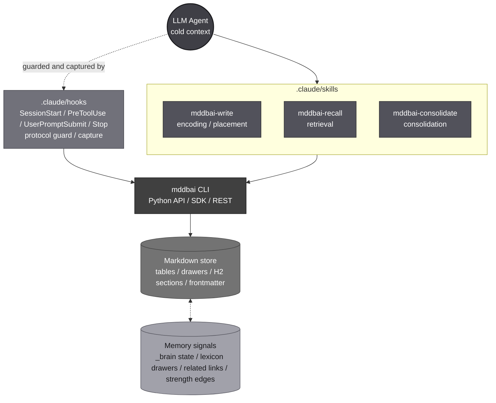

# MDDB-AI

MDDB-AI explores a fundamental question: How can simple .md files empower an AI’s memory?

In every project, valuable context — decisions, meetings, experiments, and insights — constantly accumulates. Yet, AI often loses track of information that slides out of its context window, leading to repetitive mistakes and redundant explanations. MDDB-AI bridges this gap by persisting those memories in human-readable Markdown files.

Unlike traditional search engines, Vector Databases, or Embedding-based systems, MDDB-AI relies on AI inference to navigate information. The AI evaluates the current context to determine exactly what to remember and where to store it. MDDB-AI then executes that decision through atomic writes and retrieves only the surgical segments needed for the task at hand.

The Evolution & Paradox:
Because this approach leans entirely on AI inference, MDDB-AI’s memory organization and retrieval precision will naturally improve as AI becomes more capable. Conversely, we embrace a unique paradox: if AI improves enough to manage its own long-term coherence flawlessly, future updates may eventually make MDDB-AI unnecessary.

The Goal: To enable AI to autonomously structure, store, and accurately recall information within a file system, turning a static repository into a living, evolving memory bank.

Note on Implementation:
The philosophy behind MDDB-AI is currently more advanced than its implementation. To be honest, I built this because I needed it for my own use. Since I’m building it at high speed through "Vibe Coding," there are many rough edges and areas for improvement. I am focusing on proving the concept first. I would deeply appreciate any contributions or insights to help make the code as robust as the vision.

# Flowchart




# Requirements

- Python 3.11 or later
- Operating system: **Windows** (primary target). Other OS: best-effort, not yet validated.
- AI client: **Claude Code** (primary). Other agentic CLIs (Cursor / Codex / Gemini) work but lack the same level of automatic enforcement (hooks).


# Installation

Open a terminal **at the root of your Claude Code project** (the folder where you usually launch Claude Code from), then paste one of the lines below. Everything stays inside `.mddbai/` — venv, data, Claude Code wiring — so your system Python is untouched.

**Windows (PowerShell)**
```powershell
python -m venv .mddbai\.venv; .\.mddbai\.venv\Scripts\Activate.ps1; pip install git+https://github.com/mddb-ai/mddb-ai.git; mddbai init .mddbai --with-claude-hook
```

**macOS / Linux**
```bash
python -m venv .mddbai/.venv && source .mddbai/.venv/bin/activate && pip install git+https://github.com/mddb-ai/mddb-ai.git && mddbai init .mddbai --with-claude-hook
```

After it finishes, add `.mddbai/.venv/` to `.gitignore` (the venv is per-machine; the rest of `.mddbai/` is your project's memory and may be committed to share across the team).


# Quick start

After install, the following are already in place:

- `.mddbai/` — the markdown memory palace (your project's long-term memory)
- `.claude/skills/mddbai-{write,recall,consolidate}/SKILL.md` — write / recall / consolidate playbooks for the AI
- `.claude/hooks/mddbai_*.py` — 4 Python hooks (SessionStart / PreToolUse / UserPromptSubmit / Stop)
- `.claude/settings.json` — registered hook commands wired to the `.mddbai/.venv/` Python (no PATH dependency)

Open Claude Code in this project and try:

```
> Save this decision: we will adopt the drawer model.
> What did we decide about the drawer model?
```

The AI uses the installed skills to place the memory and recall it later — no manual command typing required.

> **Reactivating the venv**: each new shell needs `.\.mddbai\.venv\Scripts\Activate.ps1` (Windows) or `source .mddbai/.venv/bin/activate` (macOS/Linux) before the `mddbai` command is on PATH. (Claude Code's hooks themselves don't need activation — they call the venv's Python by absolute relative path.)


# Status

Pre-Alpha. The philosophy is ahead of the implementation; the public surface (CLI / hooks / skills) is stable enough to dogfood, but expect breaking changes as the design matures.


# License

Apache License 2.0 — see [LICENSE](LICENSE).
